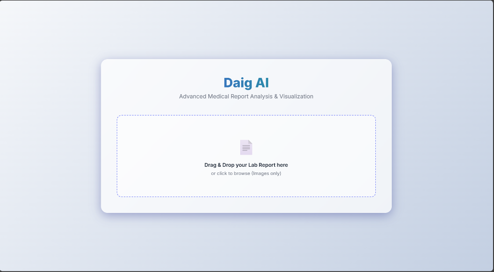
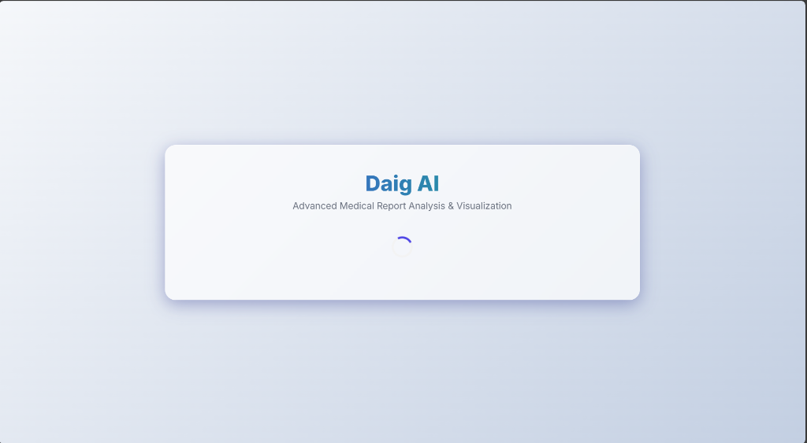
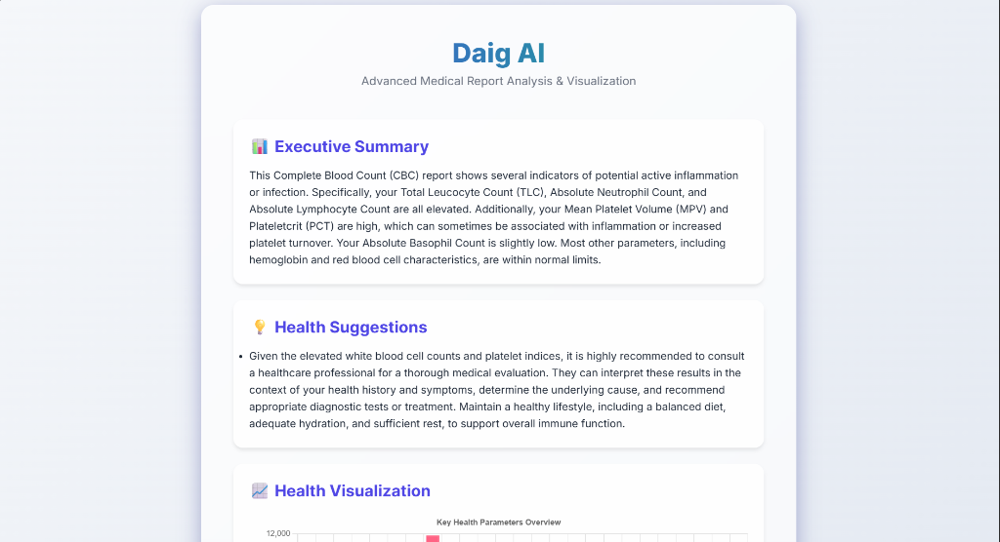
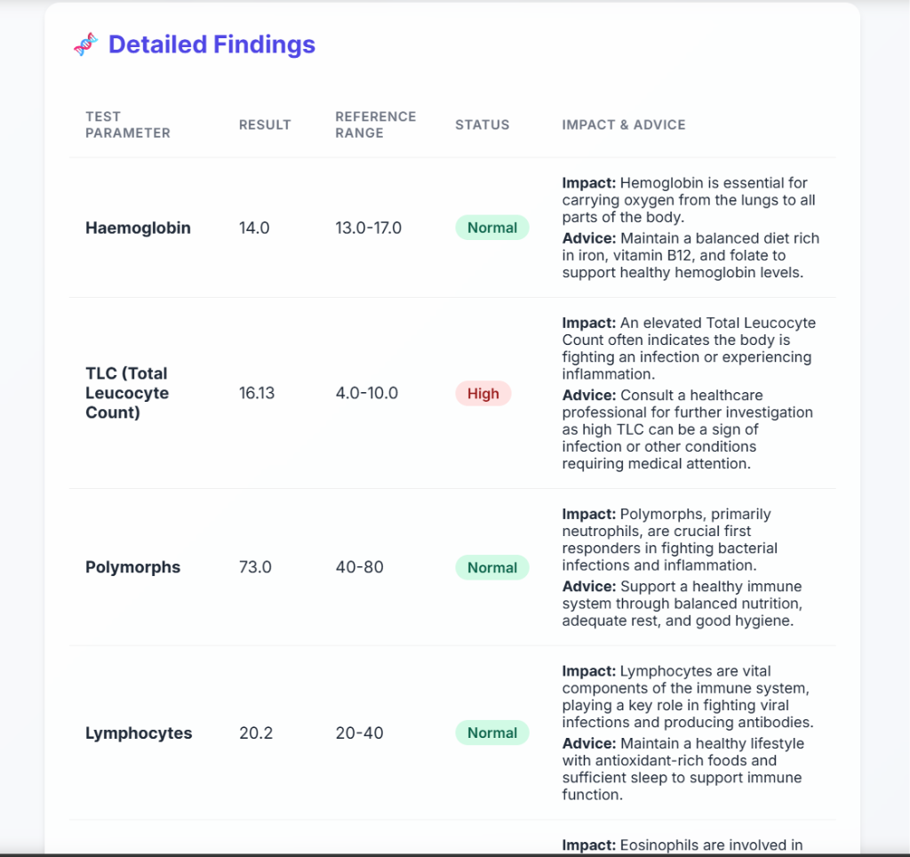

# Daig AI

Daig AI is an intelligent health agent designed to empower users by analyzing their medical reports. In its first phase, it focuses on **Complete Blood Count (CBC)** reports, providing clear, AI-driven insights, executive summaries, and personalized health suggestions to improve overall well-being.

## Features

-   **📄 Drag & Drop Interface**: Seamlessly upload lab report images (CBC) via a user-friendly drag-and-drop zone.
-   **🤖 AI-Powered Analysis**: Leverages advanced LLMs (Google Gemini / OpenAI) to extract data and interpret complex medical metrics.
-   **📊 Executive Summary**: Converts technical medical jargon into an easy-to-understand executive summary.
-   **💡 Health Suggestions**: Provides actionable lifestyle and dietary advice based on the specific report findings.
-   **📈 Visualizations**: Visualizes key health parameters to help track and understand ranges.
-   **🔍 Detailed Findings**: Breaks down each test parameter (e.g., Hemoglobin, TLC, Platelets) with status (Normal/High/Low) and impact analysis.

## Screenshots

### 🏠 Home & Upload
The landing page allows for easy drag-and-drop of report images.


### ⏳ Analysis in Progress
Real-time feedback while the AI processes the report.


### 📝 Executive Summary
A clear, high-level overview of the report's key takeaways.


### 🔬 Detailed Findings
Comprehensive breakdown of individual test metrics with contextual advice.


## Tech Stack

-   **Backend**: FastAPI (Python)
-   **Frontend**: HTML, CSS, JavaScript (Jinja2 Templates)
-   **AI Engines**: Google Generative AI (Gemini), OpenAI
-   **Server**: Uvicorn

## Getting Started

Follow these steps to set up the project locally.

### Prerequisites

-   Python 3.8 or higher
-   API Keys for Google Gemini or OpenAI

### Installation

1.  **Clone the repository:**
    ```bash
    git clone <repository_url>
    cd Traig.AI
    ```

2.  **Create and activate a virtual environment:**
    ```bash
    # Windows
    python -m venv venv
    .\venv\Scripts\activate

    # Linux/Mac
    python3 -m venv venv
    source venv/bin/activate
    ```

3.  **Install dependencies:**
    ```bash
    pip install -r requirements.txt
    ```

4.  **Environment Configuration:**
    Create a `.env` file in the root directory and add your API keys:
    ```env
    GOOGLE_API_KEY=your_gemini_api_key
    OPENAI_API_KEY=your_openai_api_key
    ```

5.  **Run the Application:**
    ```bash
    python run.py
    ```
    *Alternatively, using uvicorn directly:*
    ```bash
    uvicorn app.main:app --reload
    ```

6.  **Access the App:**
    Open your browser and navigate to `http://localhost:8000` (or the port specified in the terminal).
